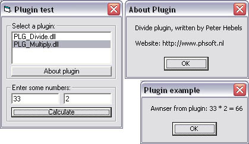



## Real plugins \(no ActiveX\)

### Description

This is a real plugin system, not just ActiveX or somthing like that!

The example plugins are written in Visual C++ and the plugin execute code is written in Visual Basic, this because it's impossible to call functions from within Visual Basic compiled dll's with this method.

Instruction on how to use and compile the example dll's are included in the package.
 
### More Info
 

             |
---                |---
**Submitted On**   |2003-09-13 10:30:08
**By**             |[Peter Hebels](https://github.com/Planet-Source-Code/PSCIndex/blob/master/ByAuthor/peter-hebels.md)
**Level**          |Advanced
**User Rating**    |4.8 (29 globes from 6 users)
**Compatibility**  |VB 5\.0, VB 6\.0
**Category**       |[Libraries](https://github.com/Planet-Source-Code/PSCIndex/blob/master/ByCategory/libraries__1-49.md)
**World**          |[Visual Basic](https://github.com/Planet-Source-Code/PSCIndex/blob/master/ByWorld/visual-basic.md)
**Archive File**   |[Real\_plugi1644979132003\.zip](https://github.com/Planet-Source-Code/peter-hebels-real-plugins-no-activex__1-48464/archive/master.zip)

